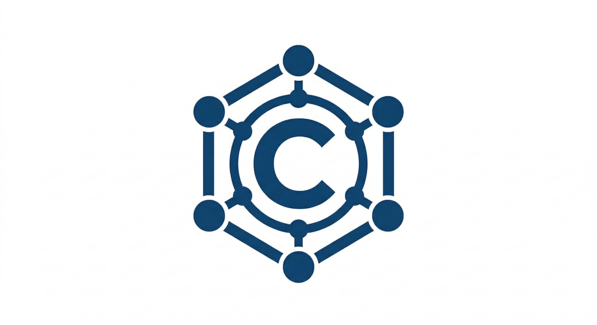

  

  <h1>C.O.R.A.</h1>
  
<b>Contractual Oversight & Risk Analyzer</b>

  
  
  

---

## 🌐 Portal Oficial
La plataforma y su presentación oficial se encuentran desplegadas de manera segura a través de: **[https://coratech.com.co](https://coratech.com.co)**

## 🎯 Sobre C.O.R.A.
Este repositorio aloja el código fuente y la arquitectura de presentación de **C.O.R.A.**, una plataforma *GovTech* y *LegalTech* de próxima generación. 

C.O.R.A. nace como una solución de infraestructura inteligente diseñada específicamente para transformar, automatizar y blindar los procesos de contratación en las entidades públicas. A través de la automatización avanzada de minutas y el control normativo estricto, la plataforma busca eliminar los cuellos de botella administrativos, mitigar los riesgos legales y asegurar la transparencia total en el manejo de los recursos del Estado.

### 🚀 Pilares de la Plataforma
* **Automatización Normativa:** Generación estructurada de documentación para diversas modalidades de selección, reduciendo drásticamente los tiempos de gestión y el margen de error humano en la contratación pública.
* **Control y Trazabilidad:** Auditoría de riesgos en tiempo real para proteger las actuaciones de la entidad y brindar seguridad jurídica a los equipos estructuradores.
* **Experiencia de Grado Institucional (UI/UX):** Interfaz diseñada bajo estándares de terminales financieros de alto nivel, ofreciendo claridad absoluta sobre volúmenes complejos de datos para una toma de decisiones eficiente.
* **Despliegue Seguro:** Arquitectura escalable y orientada a cumplir con los más altos rigores de ciberseguridad exigidos por la administración pública.

## 🛠️ Stack Tecnológico de la Landing Page
El despliegue de esta interfaz está construido utilizando tecnologías modernas y optimizadas para máxima velocidad:
* **Frontend:** HTML5, CSS3, JavaScript.
* **Infraestructura DNS:** Enrutamiento personalizado global.
* **Hosting:** GitHub Pages con certificación HTTPS forzada.

## 👥 Estructura del Equipo Operativo
El desarrollo y escalabilidad de la plataforma es impulsado por un equipo multidisciplinario especializado:
* **Dirección General & Estructuración Legal**
* **Desarrollo de Software & Arquitectura de Código**
* **Ciberseguridad & Auditoría Técnica**
* **Estrategia Comercial & Marketing**

## 🔒 Licencia y Derechos
Todos los derechos reservados. El código, diseño gráfico, marca (C.O.R.A.) y la arquitectura de este proyecto son propiedad intelectual exclusiva de sus creadores y no están bajo licencia de uso libre o redistribución sin autorización expresa.

© 2026 C.O.R.A.
